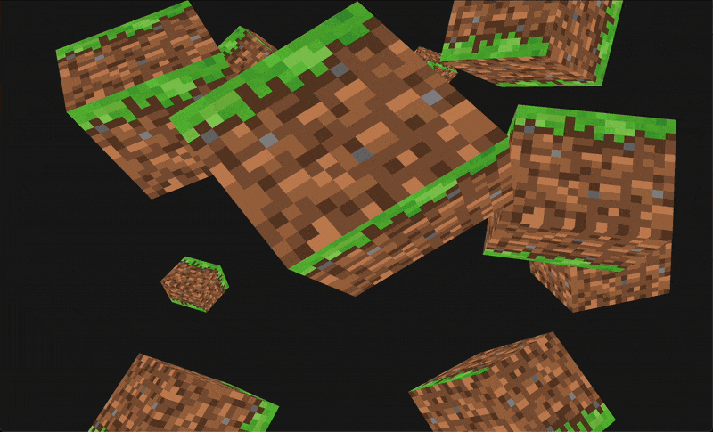

# PolaraEngine


[](https://choosealicense.com/licenses/mit/)

PolaraEngine is an easy-to-use 3D graphic engine written in CPP using OpenGL and GLFW and GLM.
Perfect for lightweight 3D games. This project will be used to make a Minecraft clone as demo.

---

## Examples

### Grass blocks
  

## Dependencies  
Make sure you have these installed to use PL:

- [OpenGL](https://www.opengl.org/) – the core graphics library  
- [GLFW](https://www.glfw.org/) – for window and input management  
- A compatible Cpp compiler (g++, clang, etc.)

---

## Build

To build the library on Linux, MacOS, or Windows, simply run:

```bash
./build.sh
```

## Documentation (W.I.P.)

Documentation is coming soon, stay tuned! 📚

## Authors

- [@matteoepitech](https://www.github.com/matteoepitech)
